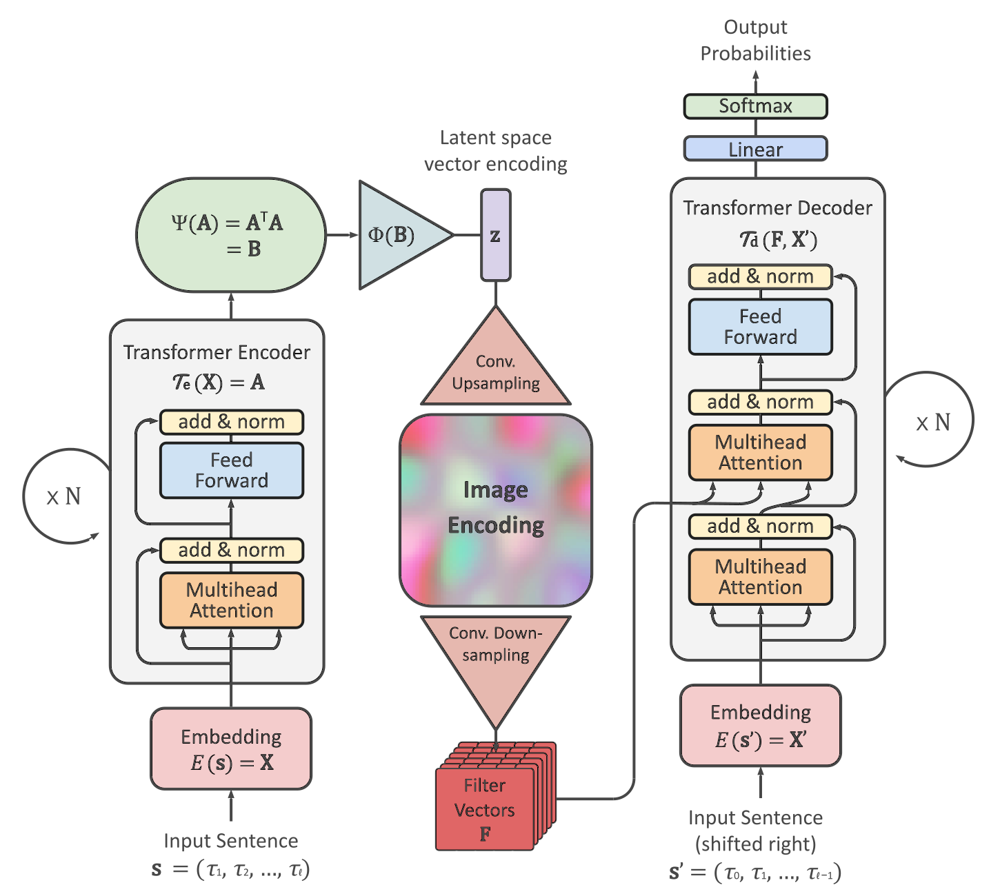
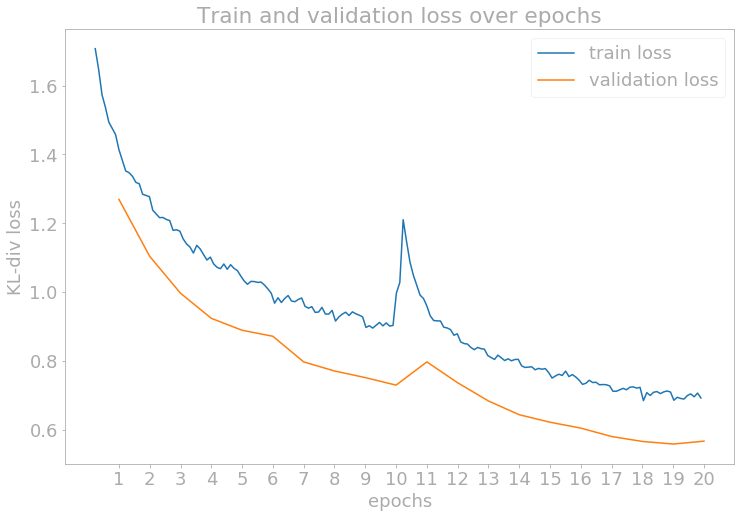
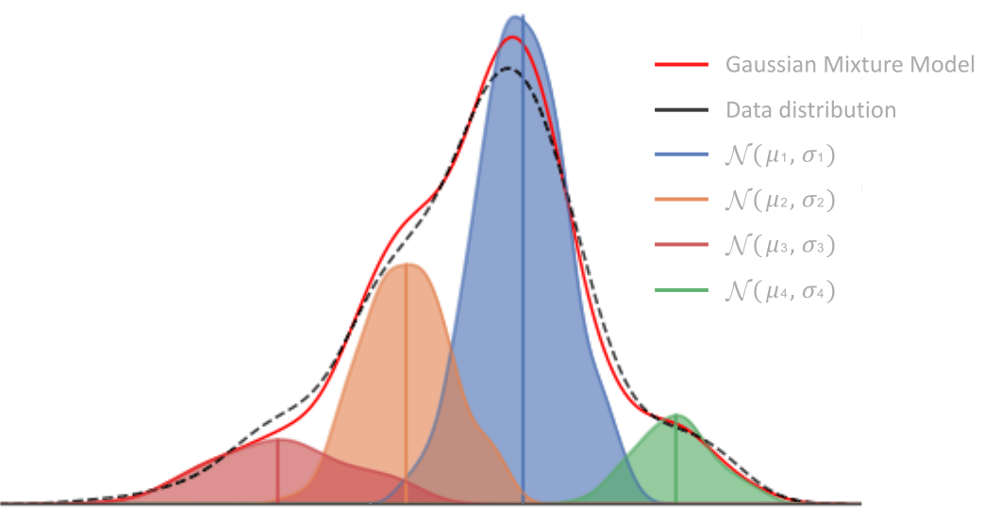
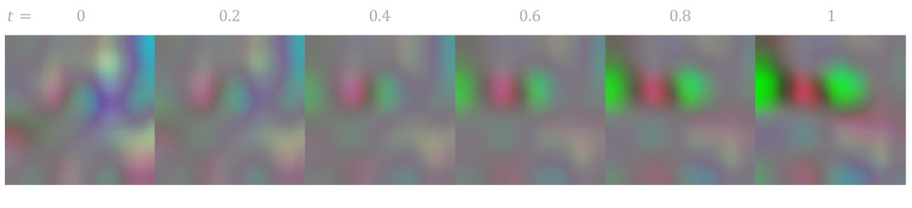
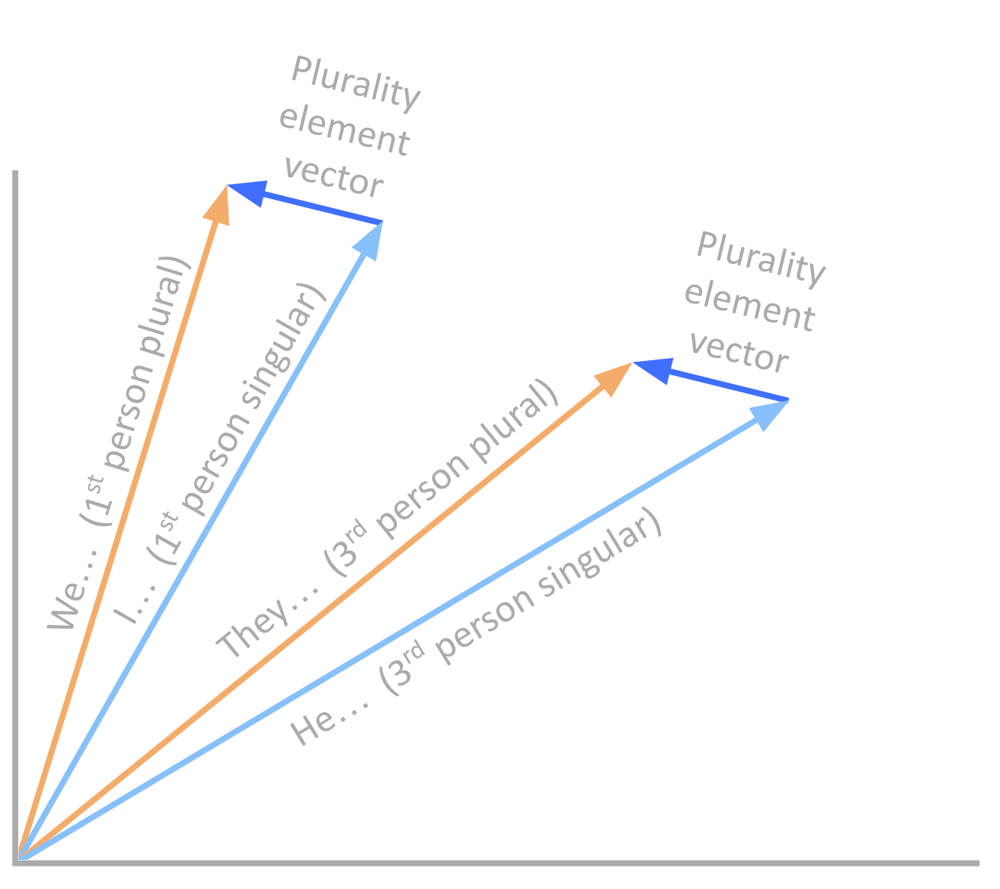

# Language Modeling Using Image Representations of Natural Language

This research presents training of an end-to-end autoencoder model using the [transformer](https://arxiv.org/abs/1706.03762), with an encoder that can encode sentences into fixed-length latent vectors and a decoder that can reconstruct the sentences using image representations. Encoding and decoding sentences to and from these image representations are central to the model design. This method allows new sentences to be generated by traversing the Euclidean space, which makes vector arithmetic possible using sentences. Machines excel in dealing with concrete numbers and calculations, but do not possess an innate infrastructure designed to help them understand abstract concepts like natural language. In order for a machine to process language, scaffolding must be provided wherein the abstract concept becomes concrete. The main objective of this research is to provide such scaffolding so that machines can process human language in an intuitive manner.

# Introduction

Language is one of the most defining traits of intelligence. The ability to communicate is often used to distinguish between intelligent and non-intelligent life, and sophisticated language is what sets humans apart from other species. Likewise, one of the hallmarks of intelligence in machines will be their ability to use language as we do.

Deep learning has made significant progress in the field of Natural Language Processing. Previous conversational models relied heavily on hard coded output responses and recognizing input key words. Conversely, language models built on deep learning are not restricted by such limitations. Recently, large language models like [GPT](https://arxiv.org/abs/2005.14165) have shown a near unlimited range in providing targeted, elaborate, human-like responses. [ChatGPT](https://openai.com/index/chatgpt/), in particular, has gained popularity as people experienced firsthand the depth and breadth of its capabilities. Even so, there are many necessary improvements to be made before language models can be truly human-like. The pinnacle of artificial intelligence will be when machines can freely speak and communicate with us and with other machines.

## Motivation

What does it mean for a machine to process language as humans do? Machines excel in dealing with concrete numbers and calculations. They do not, however, possess an innate infrastructure designed to help them understand abstract concepts like natural language. In order for a machine to process language, scaffolding must be provided wherein the abstract concept becomes concrete. [Word2Vec](https://arxiv.org/abs/1301.3781), a word embedding algorithm showed that trained word embeddings can have vector-like properties. With these properties, similar words are clustered in the latent space and simple algebraic operations can be performed using the latent vectors. A famous example of this shows $`vec(\,\texttt{king}\,) - vec(\,\texttt{man}\,) + vec(\,\texttt{woman}\,) = vec(\,\texttt{queen}\,)`$, which is an intuitive result for us. By embedding natural language into concrete vectors, we mimic the manner in which humans process language for machines. 

Word embedding proved to be successful, but difficulties arise when the embedding is scaled to sentences. While the English vocabulary is finite, vocabulary combinations allow for infinite sentence possibilities. Within the field of Natural Language Processing, this is an ongoing area of research, and much has been done to address the challenge of embedding sentences. 

The motivation for this research comes from a desire to create an image representation of natural language. Much of human language is used to describe objects of the real world. In a sense, language and images are different ways of describing the world. Another motivation is to encode language into latent variables with vector-like properties. Using the latent vectors, machines could develop a way to understand human language and also find ways to communicate. The goal of this research is to design an encoder that can encode sentences into latent vectors of such space and a decoder that can use these vectors to generate new sentences using image representations. 

## Approach

The current state-of-the-art transformer encoder model encodes sentences while preserving the length of each sentence. One of the primary challenges focused on in this research is discovering a method to find an optimal method to transform the variable-length encoding0s of the transformer into a fixed-length vector while preserving all the necessary properties and information that it contains. Another challenge is that the transformer decoder relies on attention. A single fixed-length vector is not suitable to be used as an input for the transformer decoder's attention mechanism. 

The methodology presented in this research is to design an end-to-end autoencoder model by simultaneously training an encoder and a decoder, both of which utilizes the transformer architecture. The encoder first encodes the input sentence into a fixed-length vector, after which an image representation is generated from this vector. Then, the transformer decoder attends on this image to reconstruct the original sentence. Encoding and decoding sentences to and from these image representations are central to the model design. This method allows new sentences to be generated by traversing in the latent space, which makes vector arithmetic, similar to those shown in Word2Vec, possible with sentences as well. 

# Model Design

This research presents a way to represent language with images and to train an autoencoder model end-to-end using transformer encoder and decoder. There are a few challenges with encoding and decoding language with a latent vector. The first challenge is that sentences come with varying number of words or tokens. With many of the existing language models that utilizes the transformer, the approach often times is to sum or average the transformer outputs. For autoencoder training however, the aim is to not only encode, but also to decode, hence it is necessary for the latent vector to fully encapsulate the semantics and the syntactic structure of the input sentence for reconstruction.

Another major difference with the existing language models is the decoder half. Since a key design in the transformer decoder is attention on the encoder outputs, no known attempts have been made to use the transformer decoder on a single vector. As the encoder and decoder trains simultaneously on the same latent space, there is an advantage of being able to generate new sentences from a latent vector. This research presents a novel method in encoding and decoding language to and from latent vectors by using image representations.

## Encoder Design

The main task of the encoder is to take the sequential vectors of the transformer output and contain all the necessary information about these vectors into a single vector representation. The challenge here is that the length of each sentence varies, and many sentences are structured differently linguistically. For example, some sentences start with a subject pronoun, followed by a verb and an object, whereas other sentence may start with an article, then a subject noun. Even more, interrogative sentences start with an auxiliary verb (such as be, can, do, etc.) and is then followed by the subject. With so many possible configurations for every sentence, reducing the transformer output vectors, where each vector represents corresponding input token, into a single vector without the loss of semantic and syntactic information is challenging. 

Given an embedded sentence input $\mathbf{X} \in \mathbb{R}^{\ell_\mathbf{x} \times d}$, let $`\mathcal{T}_\mathbf{e}(\mathbf{X}) = \mathbf{A}`$. Since the output dimension of $`\mathcal{T}_\mathbf{e}`$ is consistent with the input dimension, $\mathbf{A} \in \mathbb{R}^{\ell_\mathbf{x} \times d}$. The approach that is used in order to first eliminate the dimension $\ell_\mathbf{x}$ is to multiply the transpose of $\mathbf{A}$ by itself. For $\mathbf{B} = \mathbf{A}^\mathsf{T} \mathbf{A}$, $\mathbf{B} \in \mathbb{R}^{d \times d}$ is free of the sequence-length dimension $\ell_\mathbf{x}$. Define $\Psi: \mathbb{R}^{\ell_\mathbf{x} \times d} \rightarrow \mathbb{R}^{d \times d}$ as the transpose multiplication function:

```math
\begin{equation}
    \Psi(\mathbf{A}) := \mathbf{A}^\mathsf{T} \mathbf{A} \quad \text{.} \qquad\qquad (1)
\end{equation}
```

Since the dimension of the model is much larger than the sequence length, $\mathbf{A}$ almost always will be full-rank, and the $d \times d$ matrix $\mathbf{B}$ is a much larger matrix than $\mathbf{A}$. Therefore, $\Psi$ is almost always an injective function, which means that all of the necessary information of $\mathbf{A}$ is preserved in $\mathbf{B}$.

The next step is to compress the matrix $\mathbf{B}$ into a single latent vector $\mathbf{z} \in \mathbb{R}^{d}$ through some function $\Phi: \mathbb{R}^{d\times d} \rightarrow \mathbb{R}^d$ with as little loss of information as possible. First, imagine the goal is not to transform $\mathbf{B}$ into a vector, but rather an image. An image can be thought of as a 3-dimensional tensor of shape $C \times k \times k$, where $C$ is a channel dimension and $k$ is the width and height of a square image. Allow $d$ to be a divisor of $C$ so that each $i$<sup>th</sup> column of $\mathbf{B}$ multiplies with some $\frac{Ck^2}{d} \times d$ parameter matrix $W_i$, resulting in a vector that is reshaped to be an image of shape $\frac{C}{d} \times k \times k$. These are then stacked on top of each other along the channel dimension, producing a desired image of shape $C \times k \times k$. 

In order for the encoding to be a vector, simply set $k = 1$ and $C = d$. Then, the output image is of shape $d \times 1 \times 1$, which is just a $d$-dimensional vector. Each parameter matrix also reduces to a $d$-dimensional vector $w_i$, and simply dot-products with the $i$<sup>th</sup> column of $\mathbf{B}$. Let $`W = \begin{bmatrix} w_1 & \cdots & w_n \end{bmatrix}`$ and $`\mathbf{B} = \begin{bmatrix} \mathbf{b}_1 & \cdots & \mathbf{b}_n \end{bmatrix}`$. The process can be summarized as:

```math
\begin{equation}
    \Phi(\mathbf{B} \:|\: W\,) := \text{diagonal}(W^T \mathbf{B}) = \begin{bmatrix} w_1^T \mathbf{b}_1 \\ w_2^T \mathbf{b}_2 \\ \vdots \\ w_n^T \mathbf{b}_n \end{bmatrix} \quad \text{.} \qquad\qquad (2)
\end{equation}
```

Define $`\mathbf{z} := \Phi(\mathbf{B} \:|\: W\,)`$ to be the encoded latent vector for future reference.

## Decoder Design

From the latent vector $z$, the image representation is generated using traditional methods. The vector is repeatedly upsampled and fed into a CNN until a desired shape of the image is reached. The fact that images can be attended on is one of the inspirations of the decoder design. The convolutional filters of the image representation is obtained following a similar procedure as shown in [Image Captioning](https://arxiv.org/abs/1411.4555), which is then used for attention by the transformer decoder model. The transformer decoder then reconstructs the original input sentence.

The generated image representation space may act as a prior to the Euclidean latent space, since the transformer decoder model only "sees" the image representation and never actually interacts with the latent vector. This is unproven, but empirical results show that using a linear network instead to generate multiple vectors to be attended on doesn't perform nearly as well. This suggests that using image representation is actually advantageous for the decoder's performance.

## Full Model Pipeline

The details of the entire model design is presented in this section. The model is coded in Python, and the neural network model is built using the [PyTorch](https://pytorch.org/) library. A detailed diagram describing the model architecture is shown in Figure 1.

The first part of the model is the embedding model $E: |\mathcal{V}| \rightarrow d$. The embedding model is built using `nn.Embedding` module, in which $M_E$ also acts as trainable weights. The model dimension $d$ was set to be 256. The embedded input then passes through transformer encoder $\mathcal{T}_\mathbf{e}$. There are no major changes to the transformer architecture. The code for building the transformer was obtained from [The Annotated Transformer](https://nlp.seas.harvard.edu/2018/04/03/attention.html). The number of encoder layers $N$ was set to be 6, the number of attention heads for multihead attention $h$ was set to be 8, and the dimension of the feed-forward network was set to be 1024. The output of the transformer encoder progresses through the model exactly as outlined in equations 1 and 2 to produce the latent vector $\mathbf{z}$.

<div align="center">

  
  
  Figure 1: Full model diagram
</div>
<br>

To generate the image encoding from $\mathbf{z}$, it passes through a convolutional upsampling function $`\mathcal{C}_{\text{up}}: \mathbb{R}^d \rightarrow \mathbb{R}^{3 \times d_{\mathcal{I}} \times d_{\mathcal{I}}}`$, where 3 represents the RGB channel of the resulting image, and $d_{\mathcal{I}}$ is the width and height of the square image. First, $\mathbf{z}$ passes through a linear layer of output size $2d$ and is then reshaped to be a $\frac{d}{8} \times 4 \times 4$ tensor. It then passes through an initial convolutional layer with $2d$ output channels, square kernels of size 3, and stride set to be 1. All convolutional layers are built using `nn.Conv2d` module. By padding the edges by 1, this kernel size and stride preserves the shape of the image, resulting in a $2d \times 4 \times 4$ tensor output. Padding is done using `nn.ReflectionPad2d`, which pads the edges using values from the opposite edges. This helps the values at the boundaries to stay consistent with the other values during upsampling. 

The output tensor then passes through a series of upsampling and convolutional layers, designed to increase the dimensions of the image while decreasing the number of channels. For each layer, the upsampling is done using `nn.Upsample` module with bilinear interpolation, and each convolution halves the input channels while preserving the size of the image with kernel size of 3 and stride of 1 with padding. After each layer, a ReLU function is applied as the activation function. The number of layers $`N_\mathcal{C}`$ is set to be 4, hence the resulting output tensor will be of shape $\frac{d}{8} \times 64 \times 64$. This tensor is then inputted to a final convolutional layer that reduces the channel dimension to 3, so that the output is a visual image with RGB color channels. A hyperbolic tangent function is applied at the end to bound the pixel values between -1 and 1. This whole process will be summarized as:

```math
\begin{equation}
    \mathcal{C}_{\text{up}}(\mathbf{z}) = \mathcal{I} \quad \text{.}
\end{equation}
```

The downsampling method to obtain the filter vectors from the image works similarly to the upsampling method. The image tensor $\mathcal{I}$ passes through convolutional downsampling function $`\mathcal{C}_{\text{down}}: \mathbb{R}^{3 \times d_{\mathcal{I}} \times d_{\mathcal{I}}} \rightarrow \mathbb{R}^{N_\mathbf{f} \times d}`$, where $d_{\mathcal{I}}$ is the dimension of the image $\mathcal{I}$ and $N_\mathbf{f}$ is the number of filter vectors. The image first goes through an intial convolutional layer with kernel size 3 and stride 1 to set the channel dimension to be $d/2^{N_\mathcal{C}}$. Then, it passes through a series of convolutional layers, where each layer contains a convolution that halves the number of channels and also halves the image dimension by using kernel size 2 and stride 2, then another convolution that preserves the channel and image dimensions with kernel size 3 and stride 1. ReLU function is applied after as well for activation. The number of layers for downsampling is identical to the number of upsampling layers, which is set to 4. This results in 16 filter vectors of dimension $d$ that will be used as inputs for the transformer decoder. This process will be summarized as:

```math
\begin{equation}
    \mathcal{C}_{\text{down}}(\mathcal{I}) = \mathbf{F} = \begin{bmatrix} \mathbf{f}_1 & \mathbf{f}_2 & \cdots & \mathbf{f}_{N_{\mathbf{f}}} \end{bmatrix}^\mathsf{T} \quad \text{.}
\end{equation}
```

For the decoding phase, the target sentence for the transformer decoder $`\mathcal{T}_\mathbf{d}`$ is identical to the input sentence since the model is trained as an autoencoder. The only difference is that the tokens are all shifted one to the right. For example, given the filter vectors $\mathbf{F}$ and tokens $(\tau_0, \ldots, \tau_k)$ up to position $k$, the decoder's job is to predict the next token $\tau_{k+1}$. $\tau_0$ is always a start of sentence token that is used in predicting $\tau_1$. Since the input and target are the same, they also share the same embedding model. The number of layers and the number of attention heads for the decoder model are identical to that of the encoder model. 

Let $\mathbf{s} = (\tau_1, \tau_2, \ldots, \tau_\ell)$ be the input sentence and $E(\mathbf{s}) = \mathbf{X}$ be the embedded sentence. Let $\mathbf{s}' = (\tau_0, \tau_1, \ldots, \tau_{\ell-1})$ be the input sentence that is shifted one index to the right and $\mathbf{s}'_k = (\tau_0, \ldots, \tau_k)$ where $0 \leq k \leq \ell-1$. This gives $`E(\mathbf{s}'_k) = \mathbf{X}'_k`$. Using these inputs, below is a summary of the entire model pipeline:

```math
\begin{equation}
    \begin{split}
        \mathcal{T}_e(\mathbf{X}) & = \mathbf{A} \\
        \Psi(\mathbf{A}) & = \mathbf{B} \\
        \Phi(\mathbf{B}) & = \mathbf{z} \\
        \mathcal{C}_{\text{up}}(\mathbf{z}) & = \mathcal{I} \\
        \mathcal{C}_{\text{down}}(\mathcal{I}) & = \mathbf{F} \\
        (G \circ \mathcal{T}_d)(\mathbf{F}, \mathbf{X}'_k) & = p(\tau_{k+1} \:|\: \tau_1, \ldots, \tau_k) \quad \text{.}
    \end{split}
\end{equation}
```

The resulting output of the model is the probability distribution over $\mathcal{V}$ for the next token $\tau_{k+1}$.

# Method

In this chapter, the specifics of how the model was trained will be presented. First, there will be a discussion about how the data was curated, prepared, and processed. Then, the details of the training procedure will be shared, including the cost function and the optimizer. Finally, results of the training will be shown.

## Dataset

The data used to train the model is from a book dataset, where texts from many different books were collected into a single corpus. The data is prepared by assigning each word or symbol with a token. Unique tokens are gathered from the corpus to create a vocabulary set. Then, each element of the vocabulary is assigned an integer value to create a Python dictionary object. Initially the data consisted of 40 million lines of English sentences with over a million unique vocabulary tokens. In order to reduce the number of tokens, several preprocessing strategies were used. Below is a list of preprocessing that was done to reduce the size of the vocabulary:
- replace all numbers with a unique number token
- convert all % and $ symbols to words 'percent' and 'dollars'
- add spaces around all non-letter symbols
- remove all remaining non-punctuation symbols
- remove all low frequency tokens (occurs $n$ times or less throughout the dataset)
- normalize all texts by changing all letters to lowercase
- remove all sentences that are too long (over `max_len`} number of tokens)

At first, $n$ was set to 10 and `max_len` was set to 50. After processing the data, the size of vocabulary was reduced from over a million to just over 73 thousand. However, training a large model with this size was still unsuccessful, so further processing was done to reduce both the size of the vocabulary and the data. In order to further reduce the size and normalize the data, more dramatic approaches were used: 
- max_len was set from 50 to 20.
- Using the `PyEnchant` library, an English dictionary was used to remove any lines that contained words not in the dictionary. This removed all lines with uncommon proper nouns, and odd spelling of words.
- Only a tenth of the data was kept.
- Vocabulary was further reduced by setting $n$ to 20.

In the end, the vocabulary size reduced down to 16,138 and the number of lines to just under 1.3 million.

The processed dataset was then split into training, validation, and testing sets. First, 10 thousand lines were randomly selected to be the testing set. This dataset is reserved for the end of all model trainings in order to evaluate the performance of the final model. The remaining data was split into training and validation set, with 90\% of the data used for training and 10\% of the data for validation. The training dataset is used for the actual training of the model with an optimizer, and the model is evaluated after each epoch with the validation dataset to track the progress of the training. Because neural network models can often overfit to the training data, validation data is used to evaluate the model's ability to generalize to new data as it trains.

Below are some example sentences from the dataset after preprocessing:

```
i finally got my shot at some screen time .
he looked tired and worn , which troubled me more than anger would have .
i stumbled down to the ground , still making a spectacle of myself .
in turn they whispered their name , acknowledging their presence .
i spun around and backed up , unnerved by his angry look .
she climbed back up the pool steps .
it had been months since the last visit .
bored and victorious , what more could a man ask for ?
she s resting , so i do nt want you to disturb her .
the demon inside you .
so he provides a remedy for your rightful passions .
but , hey , it s a million times better than the institute !
listening carefully could produce two clues .
call me when you can , and be safe .
i ca nt connect at all in this wretched valley .
```


## Opimizer and Cost Function

Since the majority of the model is the transformer, it was ideal to follow much of the training procedure from the original paper. Optimization was done using the [Adam](https://arxiv.org/abs/1412.6980) optimizer with $\beta_1 = 0.9$, $\beta_2 = 0.98$, and $\epsilon = 10^{-9}$. The learning rate $\eta$ varied over the course of the training according to the formula

```math
\begin{align*}
    \eta = d^{-0.5}\text{min}(\texttt{i}^{-0.5}, \texttt{i} \, \omega^{-1.5})
\end{align*}
```

where $d$ is the dimension of the model, `i` is the current number of iterations of training, and $\omega$ is a hyperparameter for the number of warm-up steps. The learning rate $\eta$ increases linearly until $\texttt{i} = \omega$, from which point $\eta$ decreases gradually proportional to $\texttt{i}^{-0.5}$. $\omega$ was set to 2000.

For the cost function, Kullback-Leibler divergence, $D_{\text{KL}}$, is used, which is defined as:

```math
\begin{align}
    D_{\text{KL}}(P||Q) := {\Large\sum}_{x \in X} P(x) \text{log}(\frac{P(x)}{Q(x)})
\end{align}
```

where $P$ represents the target output probability distribution and $Q$ is the predicted output probability distribution produced by the model. In the context of language model training, the probability space is a discrete space over all vocabulary words, where the desired output distribution, $P$, has a concentrated mass at the index that maps to the correct next token. In practice, this usually means that 100\% of the mass is at the correct token and is zero everywhere else. For this training, label smoothing strategy was used, where the confidence of the correct token is subtracted by a smoothing value. The remaining mass is then spread out evenly across all other tokens. This causes the model to learn to be more unsure about the next token prediction, but helps with regularization during evaluation phase. The smoothing value was set to 0.1.

## Training

Training was done using a single NVIDIA GeForce RTX 2080 Ti GPU for 20 epochs over the training set. Each training session was done 10 epochs at a time, and after each epoch, validation loss was computed using the validation set, and a checkpoint of the model was saved. Two full training sessions were done before the validation loss started to increase, at which point a saved model with minimum validation loss was chosen to be the final model for testing. The graph from Figure 2 shows both the train and validation loss over the entire training, where the validation loss achieved a minimum score of $D_{\text{KL}} = 0.5587$. In total, the training took about 26 hours. 

<table align="center">
  <tbody>
    <tr>
      <th></th>
    </tr>
    <tr align="left">
      <th>Figure 2: Graph of train and validation loss. The validation loss is lower <br> because the model is set to evaluation mode, turning off all regularizations <br> such as normalization layers and dropout layers. The spike at epoch 10 <br> signifies a new training session with warm-up steps.</th>
    </tr>
  </tbody>
</table>

## Evaluation

Using the final model, testing was done using 10,000 sentences from the test set that had been reserved during model training and selection phase. The model achieved a loss value of $D_{\text{KL}} = 0.5478$ averaged over the test set. To evaluate the model's performance on decoding without the use of the target inputs, two different decoding strategies are used: greedy decoding and beam search decoding.

Greedy decoding is a na&iuml;ve method where the token with the highest likelihood is chosen at each generation. More precisely, given the latent vector $\mathbf{z}$, the inputs for the transformer decoder are the filter vectors $\mathbf{F}$ and  $E(\tau_0, ..., \tau_k)$ for the $k$<sup>th</sup> decoding step. Then, the generator produces the output distribution $p(\tau_{k+1} \:|\: \tau_0, \ldots, \tau_k)$. The greedy decoding method chooses 

```math
\tau_{k+1} = \text{argmax} \Bigr( p(\tau_{k+1} \:|\: \tau_0, \ldots, \tau_k) \Bigr)
```

for the next token $\tau_{k+1}$, which is then appended to the end of the current sequence as the next decoder input. This is repeated recursively until $\tau_{k+1} = \texttt{EOS}$, which signifies that the end of the sentence has been reached.

Beam search is a breadth-first search algorithm that builds a search tree, where, at each level, $\beta$ best states are stored and the rest are pruned. The stored states are then expanded further in the next level and pruned in the same way. In context of language generation, the best states refer to the most probable sequences for each generation. Observe that beam search with $\beta = 1$ is equivalent to greedy decoding. Given a trained model and a latent vector $\mathbf{z}$, the following code snippet shows the details of the beam search algorithm. The code is simplified for readability.

```
def Beam_Search(z, model, beta=5, max_len=20)
    # Obtain the convolutional filters from z
    filters = model.extract_filters(z)
    # Initialize the first token using the SOS token
    ys = SOS
    # Initialize a list to store the sequences
    top_seqs = [(ys, 0, False)] # (sequence, log-prob, is EOS)
    for i in range(max_len - 1):
        # Initialize a new list to store next generations
        new_seqs = []
        for seq, score, is_eos in top_seqs:
            # Keep and skip if sequence reached eos, 
            if is_eos:
                new_seqs.append((seq, score, is_eos))
                continue
            decoder_out = model.decode(seq, filters)
            prob_dist = model.generator(decoder_out)
            log_probs, words = torch.topk(prob_dist, beta)
            # Update and store next generation
            for log_prob, word in zip(log_probs, words):
                new_seq = torch.cat(seq, word)
                new_score = score + log_prob
                new_is_eos = True if word == EOS else False
                new_seqs.append((new_seq, new_score, new_is_eos))
        # Sort the sequences by log probability score
        top_seqs = sorted(new_seqs, key=lambda x: x[1], reverse=True)
        # Only keep beta sequences
        top_seqs = top_seqs[:beta]
        # If all current sequences reached EOS, break and return
        if sum(eos for _, _, eos in top_seqs) == beta:
            break
    return top_seqs
```

Below are some of the sentences from the test set, the image representations of the sentences, and the decoded outputs of the model using greedy decoding and beam search decoding. The beam width $\beta$ for all beam search decoding is set to 5, although not all 5 candidates are shown for all instances. The beam search outputs are ordered from most likely to least.

<table align="center">
  <thead>
    <tr>
      <th width=150>Image</th>
      <th>Input sentence</th>
      <th>Greedy decode output</th>
      <th>Beam search output(s)</th>
    </tr>
  </thead>
  <tbody align="left">
    <tr>
      <th></th>
      <th>well , maybe this once .</th>
      <th>well , maybe this once .</th>
      <th>well , maybe this once .<br>
        well , maybe this time .<br>
        well , maybe this afternoon .</th>
    </tr>
    <tr>
      <th></th>
      <th>oh , there are some things i can work with them on .</th>
      <th>oh , there are some things i can work with them on .</th>
      <th>oh , there are some things i can work with them on .</th>
    </tr>
    <tr>
      <th></th>
      <th>he based that on the number of times a cell could divide .</th>
      <th>he on that page the years of answering a force would sell youth .</th>
      <th>he regained that number on the force of a student who lay .</th>
    </tr>
  </tbody>
</table>

The following are a few more interesting examples from the test set. The first two shown are instances where the beam search clearly outperforms greedy decoding in terms of exact word-for-word matching with the input sentence. 

<table align="center">
  <thead>
    <tr>
      <th width=150>Image</th>
      <th>Input sentence</th>
      <th>Greedy decode output</th>
      <th>Top beam search output</th>
    </tr>
  </thead>
  <tbody align="left">
    <tr>
      <th></th>
      <th>if i am to train you , you re going to have to trust me .</th>
      <th>if you are to train , i m going to have to trust me i .</th>
      <th>if i am to train you , you re going to have to trust me .</th>
    </tr>
    <tr>
      <th></th>
      <th>he cheated on me with other women while we were married .</th>
      <th>he dated on me after other kids we went with harm .</th>
      <th>he cheated on me with other women while we were married .</th>
    </tr>
  </tbody>
</table>

The next two examples show all five decoded outputs of the beam search decoding. These examples demonstrate that words that are semantically similar have higher likelihoods in the output distribution $p(\tau_{k+1} \:|\: \tau_0, \ldots, \tau_k)$. 

<table align="center">
  <thead>
    <tr>
      <th width=150>Image</th>
      <th>Input sentence</th>
      <th>Beam search outputs</th>
    </tr>
  </thead>
  <tbody align="left">
    <tr>
      <th></th>
      <th>sure , i replied softly .</th>
      <th>sure , i replied softly .<br>
        sure , i softly replied .<br>
        sure , i murmured softly .<br>
        sure , i replied quietly .<br>
        sure , i replied gently .</th>
    </tr>
    <tr>
      <th></th>
      <th>they disappeared up the drive .</th>
      <th>they disappeared up the drive .<br>
        they disappeared up the road .<br>
        they disappeared up the hallway .<br>
        they disappeared up the hospital .<br>
        they disappeared up the walk .</th>
    </tr>
  </tbody>
</table>

The following example shows a case where the greedy decoding and the top beam search decoding are both not very semantically close to the input sentence, but the less likely candidates from the beam search decoding are.

<table align="center">
  <thead>
    <tr>
      <th width=150>Image</th>
      <th>Input sentence</th>
      <th>Greedy decode output
      <th>Beam search outputs</th>
    </tr>
  </thead>
  <tbody align="left">
    <tr>
      <th></th>
      <th>i ll go get the other drinks , i said smiling as i turned back toward the kitchen .</th>
      <th>i ll go get the other plate , i said as i walked back toward the tea meeting .</th>
      <th>i ll go get the other evening , i said as i leaned back toward the waitress .<br><br>
        i ll go get the other drinks , i said as i walked back toward the kitchen smiling .<br><br>
        i ll go get the other drinks , i said as i walked back toward the kitchen .</th>
    </tr>
  </tbody>
</table>

The last example shows a case where the decoded sentences are semantically similar in interesting ways with the input sentence.

<table align="center">
  <thead>
    <tr>
      <th width=150>Image</th>
      <th>Input sentence</th>
      <th>Greedy decode output
      <th>Beam search outputs</th>
    </tr>
  </thead>
  <tbody align="left">
    <tr>
      <th></th>
      <th>a kiss that still made the roots of her hair tingle .</th>
      <th>a kiss that still made the fabric of her scalp shiver .</th>
      <th>a kiss that still made the softness of her hair quiver .<br><br>
        a kiss that still made the softness of her flesh curl .</th>
    </tr>
  </tbody>
</table>

# Experiments and Analysis

Using the trained model, different experiments were conducted to find interesting properties about the latent space and the encoded vectors. Understanding the model's encoding and decoding capabilities can help us understand how the model can be used for further applications and its limitations. Throughout this chapter, let $\mathbf{E}: \mathcal{L} \rightarrow \mathbb{R}^d$ be defined as the encoding half of the entire model, $\mathbf{E} := \Phi \circ \Psi \circ \mathcal{T}_\mathbf{e} \circ E$, and let $\mathbf{D}: \mathbb{R}^d \rightarrow \mathcal{L}$ be defined as the top beam search decoding of the latent vector with $\beta = 5$. With a well trained model, $\mathbf{E}$ and $\mathbf{D}$ are theoretically the inverse functions of each other. Therefore, we first make sure $\mathbf{D}\bigr(\mathbf{E}(\mathbf{s})\bigr) \approx \mathbf{s}$ whenever an example sentence $\mathbf{s} \in \mathcal{L}$ is chosen.

## Gaussian Mixture Model Fitting

<div align="center">

  
  
  Figure 3: Gaussian mixture model can approximate distributions.
</div>

One of the underlying assumptions that led to the model design choices is that Gaussian distribution should not be used as the prior distribution of large language data. To test this assumption, a Gaussian Mixture Model was fitted on the set of latent vectors obtained from the test set. A Gaussian mixture model fitted on a distribution of data will attempt to estimate the data distribution with multiple Gaussian components, each $i$<sup>th</sup> component weighted with some scalar $\alpha_i$ with its own mean $\mu_i$ and covariance matrix $\Sigma_i$. Specifically, the prior distribution is given by 

```math
\begin{align*}
     p(\theta) = {\Large\sum}_{i=1}^{K} \alpha_i \, \mathcal{N} \bigr( \mu_i, \Sigma_i \bigr) 
\end{align*}
```

The values of the parameter for each component is updated conditioned on the data $\mathbf{x}$ by using the Expectation-Maximization algorithm and will result in a posterior distribution 

```math
\begin{align*}
     p(\theta \:|\: \mathbf{x}) = {\Large\sum}_{i=1}^{K} \tilde{\alpha}_i \, \mathcal{N} \bigr( \tilde{\mu}_i, \tilde{\Sigma}_i \bigr) 
\end{align*}
```

In Python, this can be done easily with the help of the [Scikit-Learn](https://scikit-learn.org/stable/) library.

In this experiment, a Gaussian mixture model with 20 components was used to fit the latent vectors. Afterwards, vectors were sampled from each Gaussian and decoded. For each component $i$, the sampling process can be described as 

```math
\begin{gather*}
    \mathbf{z}_i \sim \mathcal{N} \bigr( \mu_i, \Sigma_i \bigr) \\
    \mathbf{D}(\mathbf{z}_i) \rightarrow \text{decoded sentence}
\end{gather*}
```

The following shows some of the sampled vectors from three different Gaussian components decoded into sentences. The scores are the log-likelihood of the sentences defined as 

```math
\texttt{score}\bigr(\mathbf{D}(\mathbf{z})\bigr) := \text{log}\bigr(p(\tau_1, \ldots, \tau_\ell)\bigr)
```

<br>

<table align="center">
  <thead align="center">
    <tr>
      <th colspan=3>Component 1</th>
    </tr>
    <tr>
      <th>#</th>
      <th>Score</th>
      <th>Decoded</th>
    </tr>
  </thead>
  <tbody align="left">
    <tr>
    	<th>1.1</th>
    	<th>-14.57</th>
    	<th>i do , but i just arrived a small oven from another jet .</th>
    </tr>
    <tr>
    	<th>1.2</th>
    	<th>-18.10</th>
    	<th>i pushed against the air , not sure he could notice sorrow in me of a intercom .</th>
    </tr>
    <tr>
    	<th>1.3</th>
    	<th>-16.01</th>
    	<th>i wrapped my head to kiss her , when things she picked away from his father .</th>
    </tr>
    <tr>
    	<th>1.4</th>
    	<th>-24.49</th>
    	<th>i laughed in front of her lungs so softly i pushed myself forward , and immediately toward his spell .</th>
    </tr>
    <tr>
    	<th>1.5</th>
    	<th>-12.55</th>
    	<th>i grabbing their food for the point so that it creaked back .</th>
    </tr> 
    <tr>
      <th colspan=3></th>
    </tr>
  </tbody>
  <thead align="center">
    <tr>
      <th colspan=3>Component 5</th>
    </tr>
    <tr>
      <th>#</th>
      <th>Score</th>
      <th>Decoded</th>
    </tr>
  </thead>
  <tbody align="left">
    <tr>
      <th>5.1</th>
      <th>-16.63</th>
      <th>what have yourself in there , do nt she come !</th>
    </tr>
    <tr>
      <th>5.2</th>
      <th>-11.71</th>
      <th>was huh there focus to world ?</th>
    </tr>
    <tr>
      <th>5.3</th>
      <th>-12.52</th>
      <th>how could this baby how your parents we re with him ?</th>
    </tr>
    <tr>
      <th>5.4</th>
      <th>-18.36</th>
      <th>are you wondering why to do it down the family time in home ?</th>
    </tr>
    <tr>
      <th>5.5</th>
      <th>-12.81</th>
      <th>you know who was everything , was her ?</th>
    </tr>
    <tr>
      <th colspan=3></th>
    </tr>
  </tbody>
  <thead align="center">
    <tr>
      <th colspan=3>Component 18</th>
    </tr>
    <tr>
      <th>#</th>
      <th>Score</th>
      <th>Decoded</th>
    </tr>
  </thead>
  <tbody align="left">
    <tr>
    	<th>18.1</th>
    	<th>-14.47</th>
    	<th>the rest might change in any amount of worlds .</th>
    </tr>
    <tr>
    	<th>18.2</th>
    	<th>-11.44</th>
    	<th>the houses shall look complete , both of prison .</th>
    </tr>
    <tr>
    	<th>18.3</th>
    	<th>-6.44</th>
    	<th>men to the field too .</th>
    </tr>
    <tr>
    	<th>18.4</th>
    	<th>-6.97</th>
    	<th>the prince will leave very somewhat surprised .</th>
    </tr>
    <tr>
    	<th>18.5</th>
    	<th>-8.49</th>
    	<th>the last skill disappear .</th>
    </tr>
  </tbody>
</table>

From the decoded sentence, it can be observed that when a Gaussian mixture model is used, the type of sentences that cluster around each of the components are largely influenced by the first few words of the sentence. However, most of the decoded sentences are nonsensical. This is reflected by the sentence scores, which can be used as a metric to determine how likely a given vector can be decoded as a sensible sentence. This metric is used for further experiments to measure the viability of the decoded sentences.


## Linear Interpolation

Let $\mathbf{s}_1, \mathbf{s}_2 \in \mathcal{L}$ and let $\mathbf{E}(\mathbf{s}_1) = \mathbf{z}_1$, $\mathbf{E}(\mathbf{s}_2) = \mathbf{z}_2$. One simple experiment that can be done using these two vectors is a linear interpolation 

```math
\mathbf{z}_t = (1-t) \,\mathbf{z}_1 + t \,\mathbf{z}_2 \quad \text{for} \quad 0\leq t \leq 1 \quad \text{.}
```

By decoding $\mathbf{z}_t$ for different values of $t$, it can be observed whether $\mathbf{\mathbf{z}_t}$ shows a smooth transition between the sentences $\mathbf{s}_1$ and $\mathbf{s}_2$. The linear interpolation experiment was first conducted with the sentences 

```math
\begin{align*}
    \mathbf{s}^1 & = \texttt{he stayed completely still for the next moment .} \\
    \mathbf{s}^2 & = \texttt{then she continued as calmly as she could .}
\end{align*}
```

The following shows the images and the decoded sentences of $\mathbf{z}_t$ for varying values of $t$:

<table align="center">
  <tbody>
    <tr>
      <th colspan=3></th>
    </tr>
    <tr>
      <th>$t$</th>
      <th>$D(z_t)$</th>
      <th>score</th>
    </tr>
    <tr>
      <th>$0$</th>
      <th>he stayed completely still for the next moment .</th>
      <th>-1.09</th>
    </tr>
    <tr>
      <th>$0.2$</th>
      <th>he stayed completely still for the next then .</th>
      <th>-4.12</th>
    </tr>
    <tr>
      <th>$0.4$</th>
      <th>she stayed now as his head barely i wondered .</th>
      <th>-9.13</th>
    </tr>
    <tr>
      <th>$0.6$</th>
      <th>then she stayed silent as he ever watched .</th>
      <th>-6.92</th>
    </tr>
    <tr>
      <th>$0.8$</th>
      <th>then she continued quietly as she could at my wounds .</th>
      <th>-5.11</th>
    </tr>
    <tr>
      <th>$1$</th>
      <th>then she continued as calmly as she could .</th>
      <th>-0.99</th>
    </tr>
  </tbody>
</table>

The result shows a smooth transition of the images, and the token-wise transition of $\mathbf{D}(\mathbf{z}_t)$ seems acceptable but don't make a lot of sense grammatically or semantically, which is evident from the increased log-probability scores of the transition sentences. This is likely because the two sentences are not similar enough, so the experiment was repeated with more similar pairs of sentences. Below shows a linear interpolation between the sentences 

```math
\begin{align*}
    \mathbf{s}^3 & =\texttt{my mom was upset when she saw me .} \\
    \mathbf{s}^4 & = \texttt{my dad is happy to see you .}
\end{align*}
```

<table align="center">
  <tbody>
    <tr>
      <th>$t$</th>
      <th>$\mathbf{D}(\mathbf{z}_t)$</th>
      <th>score</th>
    </tr>
    <tr>
      <th>$0-0.2$</th>
      <th>my mom was upset when she saw me .</th>
      <th>-0.76</th>
    </tr>
    <tr>
      <th>$0.5$</th>
      <th>my mom was happy to see me now .</th>
      <th>-5.94</th>
    </tr>
    <tr>
      <th>$0.6$</th>
      <th>my dad is upset to see you happy .</th>
      <th>-5.66</th>
    </tr>
    <tr>
      <th>$0.7$</th>
      <th>my dad is happy to see you upset .</th>
      <th>-2.37</th>
    </tr>
    <tr>
      <th>$0.8-1$</th>
      <th>my dad is happy to see you .</th>
      <th>-0.99</th>
    </tr>
  </tbody>
</table>

These results show a smoother transition between the two sentences and the transitions are grammatically correct as well. This suggest a sparsity of vectors in the latent space that are likely to be sentences.

Finally, a linear combination between three different sentences was done using words of emotion.

```math
\begin{align}
    \mathbf{s}_\text{happy} & = \: \texttt{i am happy .} & \mathbf{E} \bigr(\mathbf{s}_\text{happy} \bigr) & = \: \mathbf{z}_\text{happy} \\
    \mathbf{s}_\text{disappointed} & = \: \texttt{i am disappointed .} & \mathbf{E} \bigr(\mathbf{s}_\text{disappointed} \bigr) & = \: \mathbf{z}_\text{disappointed} \\
    \mathbf{s}_\text{excited} & = \: \texttt{i am excited .} & \mathbf{E} \bigr(\mathbf{s}_\text{excited} \bigr) & = \: \mathbf{z}_\text{excited}
\end{align}
```

Below are few combinations that produced interesting results:

```math
\begin{gather*}
    \mathbf{D}\bigr(0.5\,\mathbf{z}_\text{disappointed} + 0.5\,\mathbf{z}_\text{excited}\bigr) = \texttt{i am angry .} \\
    \mathbf{D}\bigr(-0.7\,\mathbf{z}_\text{happy} + 0.8\,\mathbf{z}_\text{disappointed} + 0.9\,\mathbf{z}_\text{excited}\bigr) = \texttt{i am annoyed .} \\
    \mathbf{D}\bigr(-\mathbf{z}_\text{happy} + \mathbf{z}_\text{disappointed} + \mathbf{z}_\text{excited}\bigr) = \texttt{i am humor curious .}
\end{gather*}
```

These results show that emotions may lie in a particular subset of the latent space, which may be traversed to produce different emotion for the output sentence.

## Vector Operations

 The [Word2Vec](https://arxiv.org/abs/1301.3781) model showed that it is possible to perform vector operations of encoded words to manipulate the semantics of words. One famous example is $`\texttt{king} - \texttt{man} + \texttt{woman} = \texttt{queen}`$ which is the expected and desired output. In this section, similar experiments are performed with encoded sentences.

### Subject Pronoun Manipulation

For the first experiment, the goal is to manipulate the subject pronouns. The following sentences are identical except for their subject pronouns:

```math
\begin{align}
    \mathbf{s}^1_\text{he} & = \: \texttt{he stayed completely still for the next moment .} & \mathbf{E} \bigr(\mathbf{s}^1_\text{he} \bigr) & = \: \mathbf{z}^1_\text{he} \\
    \mathbf{s}^1_\text{she} & = \: \texttt{she stayed completely still for the next moment .} & \mathbf{E} \bigr(\mathbf{s}^1_\text{she}\bigr) & = \: \mathbf{z}^1_\text{she} \\
    \mathbf{s}^1_\text{they} & = \: \texttt{they stayed completely still for the next moment .} & \mathbf{E} \bigr(\mathbf{s}^1_\text{they}\bigr) & = \: \mathbf{z}^1_\text{they} \\
    \mathbf{s}^1_\text{I} & = \: \texttt{i stayed completely still for the next moment .} & \mathbf{E} \bigr(\mathbf{s}^1_\text{I}\bigr) & = \: \mathbf{z}^1_\text{I} \\
    \mathbf{s}^1_\text{you} & = \: \texttt{you stayed completely still for the next moment .} & \mathbf{E} \bigr(\mathbf{s}^1_\text{you}\bigr) & = \: \mathbf{z}^1_\text{you} \\
    \mathbf{s}^1_\text{we} & = \: \texttt{we stayed completely still for the next moment .} & \mathbf{E} \bigr(\mathbf{s}^1_\text{we}\bigr) & = \: \mathbf{z}^1_\text{we} \\
\end{align}
```

Since each of these sentences are identical except for the subject pronouns, the difference of two sentences would represent the difference in the pronouns used. For example, since 'I' is a first-person singular pronoun and 'we' is a first-person plural pronoun, the difference $\mathbf{z}^1_\text{we} - \mathbf{z}^1_\text{I}$ will represent the plurality element. Then, the expected outcome when adding this difference to $\mathbf{z}^1_\text{he}$, a third-person singular pronoun, would be a vector close to $\mathbf{z}^1_\text{they}$, a third-person plural pronoun. The following shows the result of the experiment.

```math
\begin{align*}
    \mathbf{D} \bigr(\mathbf{z}^1_\text{we} - \mathbf{z}^1_\text{I} + \mathbf{z}^1_\text{he} \bigr) & = \texttt{they stayed completely still for the next moment .} \\
    \mathbf{D} \bigr(\mathbf{z}^1_\text{they} - \mathbf{z}^1_\text{he} + \mathbf{z}^1_\text{I} \bigr) & = \texttt{completely we stayed still for the next moment .} \\
    \mathbf{D} \bigr(\mathbf{z}^1_\text{they} - \mathbf{z}^1_\text{he} + \mathbf{z}^1_\text{you} \bigr) & = \texttt{you stayed completely still for their next time .}
\end{align*}
```

<div align="center">

  

  Figure 4: Illustration of vector operations between<br>two pairs of vectors and their difference.
</div>

Although there were some changes to the sentence itself for some, the subject pronouns of the output were changed as intended. The reverse of this experiment was conducted and showed a similar result.

```math
\begin{align*}
    \mathbf{D} \bigr(\mathbf{z}^1_\text{I} - \mathbf{z}^1_\text{we} + \mathbf{z}^1_\text{they} \bigr) & = \texttt{completely he stayed still for her next moment .} \\
    \mathbf{D} \bigr(\mathbf{z}^1_\text{he} - \mathbf{z}^1_\text{they} + \mathbf{z}^1_\text{we} \bigr) & = \texttt{i stayed completely still for the next moment .}
\end{align*}
```

Similar experiment was conducted but instead adding the difference of sentences in $\mathbf{s}^1$ to a new sentence $\mathbf{s}^2$

```math
\begin{align*}
    \mathbf{s}^2_\text{he} = \texttt{then he continued as calmly as he could .} \quad \mathbf{E} \bigr(\mathbf{s}^2_\text{he}\bigr) = \mathbf{z}^2_\text{he}
\end{align*}
```

```math
\begin{align*}
    \mathbf{D} \bigr(\mathbf{z}^1_\text{they} - \mathbf{z}^1_\text{he} + \mathbf{z}^2_\text{he} \bigr) & = \texttt{then they continued as calmly as he could .} \\
    \mathbf{D} \bigr(\mathbf{z}^1_\text{we} - \mathbf{z}^1_\text{i} + \mathbf{z}^2_\text{he} \bigr) & = \texttt{then they continued as he calmly as we could .} \\
    \mathbf{D} \bigr(\mathbf{z}^1_\text{she} - \mathbf{z}^1_\text{he} + \mathbf{z}^2_\text{he} \bigr) & = \texttt{then she continued as calmly as he could .}
\end{align*}
```

The subject pronouns changed as desired, but subject-object agreement wasn't achieved, which suggest that the vectors for the subject and the object may be parts of a separate subset of the latent space.

### Tense Manipulation
The following experiment shows manipulation of tense for the predicate. The sentences used and the result of the vector operations are shown below.
\begin{center}
    {\renewcommand{\arraystretch}{1}
    \begin{tabular}{l l l l}
        $\mathbf{s}^3_\text{present}$ & = \: \texttt{\footnotesize i am there .} & $\mathbf{E} \bigr(\mathbf{s}^3_\text{present} \bigr)$ & = \: $\mathbf{z}^3_\text{present}$ \\
        $\mathbf{s}^3_\text{future}$ & = \: \texttt{\footnotesize i will be there .} & $\mathbf{E} \bigr(\mathbf{s}^3_\text{future} \bigr)$ & = \: $\mathbf{z}^3_\text{future}$ \\
        $\mathbf{s}^3_\text{past}$ & = \: \texttt{\footnotesize i was there .} & $\mathbf{E} \bigr(\mathbf{s}^3_\text{past} \bigr)$ & = \: $\mathbf{z}^3_\text{past}$ \\
        $\mathbf{s}^4_\text{present}$ & = \: \texttt{\footnotesize i am going with you .} & $\mathbf{E} \bigr(\mathbf{s}^4_\text{present} \bigr)$ & = \: $\mathbf{z}^4_\text{present}$
    \end{tabular}
    }
\end{center}
\begin{align*}
    \mathbf{D} \bigr(\mathbf{z}^3_\text{future} + \mathbf{z}^3_\text{past} \bigr) & = \texttt{\footnotesize i m there .} \\
    \mathbf{D} \bigr(\mathbf{z}^3_\text{future} - \mathbf{z}^3_\text{present} + \mathbf{z}^4_\text{present} \bigr) & = \texttt{\footnotesize i will be going with you .} \\
    \mathbf{D} \bigr(\mathbf{z}^3_\text{past} - \mathbf{z}^3_\text{present} + \mathbf{z}^4_\text{present} \bigr) & = \texttt{\footnotesize i was going with you .}
\end{align*}

Using the sentences from $s^1$, further experiment is done to manipulate both the subject pronoun and the tense at once. 
\begin{align*}
    \mathbf{D} \bigr(\mathbf{z}^1_\text{they} - \mathbf{z}^1_\text{i} + \mathbf{z}^4_\text{present} \bigr) & = \texttt{\footnotesize they are going with you .} \\
    \mathbf{D} \bigr(\mathbf{z}^1_\text{they} - \mathbf{z}^1_\text{i} + \mathbf{z}^3_\text{future} - \mathbf{z}^3_\text{present} + \mathbf{z}^4_\text{present} \bigr) & = \texttt{\footnotesize they will be going with you .} \\
    \mathbf{D} \bigr(\mathbf{z}^1_\text{they} - \mathbf{z}^1_\text{i} + \mathbf{z}^3_\text{past} - \mathbf{z}^3_\text{present} + \mathbf{z}^4_\text{present} \bigr) & = \texttt{\footnotesize they was going with you .}
\end{align*}
The result shows that both the subject and the predicate changed as intended. Although the first result achieved subject-verb agreement, the third did not. This was fixed by adjusting the weight of the differences, as shown below:
\begin{align*}
    \mathbf{D} \bigr(\mathbf{z}^1_\text{they} - \mathbf{z}^1_\text{i} + 0.5(\mathbf{z}^3_\text{past} - \mathbf{z}^3_\text{present}) + \mathbf{z}^4_\text{present} \bigr) & = \texttt{\footnotesize they were going with you .}
\end{align*}

Further experiment was done using the verbs `run' and `ran'. The results weren't as consistent but produced some interesting outputs.
\begin{center}
    {\renewcommand{\arraystretch}{1}
    \begin{tabular}{l l l l}
        $\mathbf{s}^5_\text{present}$ & = \: \texttt{\footnotesize i run in the morning .} & $\mathbf{E} \bigr(\mathbf{s}^5_\text{present} \bigr)$ & = \: $\mathbf{z}^5_\text{present}$ \\
        $\mathbf{s}^5_\text{past}$ & = \: \texttt{\footnotesize i ran in the morning .} & $\mathbf{E} \bigr(\mathbf{s}^5_\text{past} \bigr)$ & = \: $\mathbf{z}^5_\text{past}$
    \end{tabular}
    }
\end{center}
\begin{align*}
    \mathbf{D} \bigr(\mathbf{z}^3_\text{future} - \mathbf{z}^3_\text{present} + \mathbf{z}^5_\text{present} \bigr) & = \texttt{\footnotesize i ll run in the morning being .} \\
    \mathbf{D} \bigr(\mathbf{z}^3_\text{past} - \mathbf{z}^3_\text{present} + \mathbf{z}^5_\text{present} \bigr) & = \texttt{\footnotesize i run in the morning .} \\
    \mathbf{D} \bigr(1.2(\mathbf{z}^3_\text{past} - \mathbf{z}^3_\text{present}) + \mathbf{z}^5_\text{present} \bigr) & = \texttt{\footnotesize i slid in the morning run .} \\
    \mathbf{D} \bigr(\mathbf{z}^5_\text{past} - \mathbf{z}^5_\text{present} + \mathbf{z}^3_\text{present} \bigr) & = \texttt{\footnotesize i were there .}
\end{align*}

### Negation
This experiment shows negations of sentences using the word `not'.
\begin{align*}
    \mathbf{s}^3_\text{not} = \texttt{\footnotesize i am not there .} \quad \mathbf{E} \bigr(\mathbf{s}^3_\text{not}\bigr) = \mathbf{z}^3_\text{not}
\end{align*}
\begin{align*}
    \mathbf{D} \bigr(\mathbf{z}^3_\text{not} - \mathbf{z}^3_\text{present} + \mathbf{z}^5_\text{future} \bigr) & = \texttt{\footnotesize i will not be there .} \\
    \mathbf{D} \bigr(\mathbf{z}^3_\text{not} - \mathbf{z}^3_\text{present} + \mathbf{z}^5_\text{past} \bigr) & = \texttt{\footnotesize i was not there .} \\
    \mathbf{D} \bigr(\mathbf{z}^3_\text{not} - \mathbf{z}^3_\text{present} + \mathbf{z}^5_\text{present} \bigr) & = \texttt{\footnotesize i run not in the morning .} \\
    \mathbf{D} \bigr(\mathbf{z}^3_\text{not} - \mathbf{z}^3_\text{present} + \mathbf{z}^4_\text{present} \bigr) & = \texttt{\footnotesize i am not going with you .} \\
    \mathbf{D} \bigr(\mathbf{z}^3_\text{not} - \mathbf{z}^3_\text{present} + \mathbf{z}^1_\text{he} \bigr) & = \texttt{\footnotesize he stayed completely not still for the next moment .} \\
    \mathbf{D} \bigr(\mathbf{z}^3_\text{not} - \mathbf{z}^3_\text{present} + \mathbf{z}^2_\text{he} \bigr) & = \texttt{\footnotesize then he continued not as calmly as he could .}
\end{align*}
When there isn't an auxiliary (be, will, can, do, etc.) verb, negation is done by inserting the `do' verb. Although the model wasn't able to achieve that, it still placed `not' in the grammatically correct places.

### Statements vs. Questions
Next, experiments were conducted to see whether statements could be turned into questions and vice-versa.
\begin{center}
    {\renewcommand{\arraystretch}{1}
    \begin{tabular}{l l l l}
        $\mathbf{s}^6_\text{statement}$ & = \: \texttt{\footnotesize you can go home .} & $\mathbf{E} \bigr(\mathbf{s}^6_\text{statement} \bigr)$ & = \: $\mathbf{z}^6_\text{statement}$ \\
        $\mathbf{s}^6_\text{question}$ & = \: \texttt{\footnotesize can you go home ?} & $\mathbf{E} \bigr(\mathbf{s}^6_\text{question} \bigr)$ & = \: $\mathbf{z}^6_\text{question}$ \\
        $\mathbf{s}^3_\text{question}$ & = \: \texttt{\footnotesize am i there ?} & $\mathbf{E} \bigr(\mathbf{s}^3_\text{question} \bigr)$ & = \: $\mathbf{z}^3_\text{question}$ \\
        $\mathbf{s}^4_\text{question}$ & = \: \texttt{\footnotesize am i going with you ?} & $\mathbf{E} \bigr(\mathbf{s}^4_\text{question} \bigr)$ & = \: $\mathbf{z}^4_\text{question}$
    \end{tabular}
    }
\end{center}
\begin{align*}
    \mathbf{D} \bigr(\mathbf{z}^6_\text{question} - \mathbf{z}^6_\text{statement} + \mathbf{z}^3_\text{present} \bigr) & = \texttt{\footnotesize am i there ?} \\
    \mathbf{D} \bigr(\mathbf{z}^6_\text{question} - \mathbf{z}^6_\text{statement} + \mathbf{z}^3_\text{future} \bigr) & = \texttt{\footnotesize will i be there ?} \\
    \mathbf{D} \bigr(\mathbf{z}^6_\text{question} - \mathbf{z}^6_\text{statement} + \mathbf{z}^3_\text{past} \bigr) & = \texttt{\footnotesize i was there ?} \\
    \mathbf{D} \bigr(1.5(\mathbf{z}^6_\text{question} - \mathbf{z}^6_\text{statement}) + \mathbf{z}^3_\text{past} \bigr) & = \texttt{\footnotesize was i there ?} \\
    \mathbf{D} \bigr(\mathbf{z}^6_\text{question} - \mathbf{z}^6_\text{statement} + \mathbf{z}^4_\text{present} \bigr) & = \texttt{\footnotesize am i going with you ?} \\
    \mathbf{D} \bigr(\mathbf{z}^6_\text{statement} - \mathbf{z}^6_\text{question} + \mathbf{z}^3_\text{question} \bigr) & = \texttt{\footnotesize i am there .} \\
    \mathbf{D} \bigr(\mathbf{z}^6_\text{question} - \mathbf{z}^6_\text{statement} + \mathbf{z}^4_\text{question} \bigr) & = \texttt{\footnotesize i am going with you .} 
\end{align*}

### Command vs. Request
Finally, experiments were conducted to see whether commands could be turned into requests and vice-versa. 
\begin{center}
    {\renewcommand{\arraystretch}{1}
    \begin{tabular}{l l l l}
        $\mathbf{s}^7_\text{command}$ & = \: \texttt{\footnotesize clean your room .} & $\mathbf{E} \bigr(\mathbf{s}^7_\text{command} \bigr)$ & = \: $\mathbf{z}^7_\text{command}$ \\
        $\mathbf{s}^7_\text{request}$ & = \: \texttt{\footnotesize can you clean your room ?} & $\mathbf{E} \bigr(\mathbf{s}^7_\text{request} \bigr)$ & = \: $\mathbf{z}^7_\text{request}$ \\
        $\mathbf{s}^8_\text{command}$ & = \: \texttt{\footnotesize come to my house .} & $\mathbf{E} \bigr(\mathbf{s}^8_\text{command} \bigr)$ & = \: $\mathbf{z}^8_\text{command}$ \\
        $\mathbf{s}^8_\text{request}$ & = \: \texttt{\footnotesize can you come to my house ?} & $\mathbf{E} \bigr(\mathbf{s}^8_\text{request} \bigr)$ & = \: $\mathbf{z}^8_\text{request}$
    \end{tabular}
    }
\end{center}
\begin{align*}
    \mathbf{D} \bigr(\mathbf{z}^7_\text{request} - \mathbf{z}^7_\text{command} + \mathbf{z}^8_\text{command} \bigr) & = \texttt{\footnotesize can you come to my house ?} \\
    \mathbf{D} \bigr(\mathbf{z}^7_\text{command} - \mathbf{z}^7_\text{request} + \mathbf{z}^8_\text{request} \bigr) & = \texttt{\footnotesize come to my house .} \\
    \mathbf{D} \bigr(\mathbf{z}^8_\text{request} - \mathbf{z}^8_\text{command} + \mathbf{z}^7_\text{command} \bigr) & = \texttt{\footnotesize can you clean your room ?} \\
    \mathbf{D} \bigr(\mathbf{z}^8_\text{command} - \mathbf{z}^8_\text{request} + \mathbf{z}^7_\text{request} \bigr) & = \texttt{\footnotesize clean your room .} 
\end{align*}

The results for this and the previous experiment suggest that the structure of the sentence may be a subset of the latent space as well. Isolating these elements could lead to a new way of building output sentences within the latent space.
